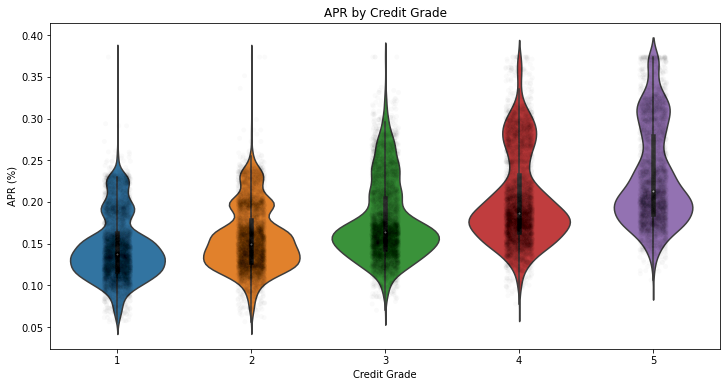
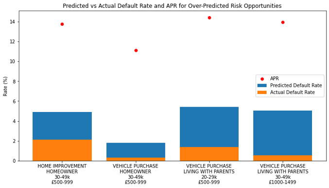

# Credit Risk Insights & Optimisation

## Overview

**Insurer XYZ** has recently expanded into **Personal Loans** and seeks to enhance its understanding of **Credit Risk performance** while identifying opportunities for **lending optimisation**. This project explores key insights from loan data, evaluates **default rate predictions**, and uncovers opportunities for refining risk strategies to maximize profitability.

## Key Insights

### 📌 Conversion Funnel Analysis
- **Quotes to Applications:** Customers engage with quotes but may drop off before applying—potential for better retention.
- **Applications to Loans:** Strong acceptance rates, with room for strategic improvements at an appropriate risk level.

### 📌 Predicted Loss & Default Rates
- **Credit Grade Segmentation:** Seven distinct bands of predicted loss rates were identified.
- **Risk Calibration:** Opportunities exist to improve predicted loss accuracy and portfolio risk management.
- **Default Trends:** A clear link between credit grade and default rates, highlighting potential for enhanced prediction models.

### 📌 Pricing Patterns
- **APR Segmentation:** Analysis reveals tri-modal APR distribution shifts, potentially influenced by external events.
- **Risk-Based Pricing:** APR aligns with credit grade decisioning, though further refinements could enhance competitiveness.
- **Violin Plot Representation:** The following violin plot illustrates the APR distribution across credit grades, highlighting the tri-modal nature of pricing shifts.
  
  

## Optimisation Strategy

### 🎯 Objective
- Identify **misaligned risk predictions** and uncover **opportunities for strategic lending improvements**.

### 🛠️ Methodology
1. **Segment data** based on key factors (Loan Purpose, Residential Status, Income, Debt-to-Income, etc.).
2. **Compare default rates** to predicted losses to identify under- and over-predicted risk segments.
3. **Evaluate lending strategies** to refine accept rates, pricing, and product offerings.

### 🔥 Key Opportunities Identified
- **Under-Predicted Risk Segments:**
  - High acceptance (>70%) with significant unexpected losses (£2.95m).
  - **Recommendation:** Increase APRs, adjust acceptance thresholds, discourage long-term loans.

- **Over-Predicted Risk Segments:**
  - Low-risk borrowers (Unsecured Debt <£10k, Debt-to-Income <5, Disposable Income >£500).
  - **Recommendation:** Increase accept rates by relaxing strategy/cutoffs, offer lower APRs, and introduce targeted promotions.
  - **Graph Representation:**
  
  

## Further Analyses & Modelling
- **Time series monitoring** for trend analysis.
- **Open banking data** integration for affordability and fraud detection.
- **Credit Reference Agency (CRA) data** to refine default predictions.
- **Dynamic pricing models** for risk-adjusted APR offerings.

## 🔍 Explore the Work
📊 **[Presentation: Credit Risk Insights & Optimisation](./Insights%20and%20Optimisation%20Presentation.pptx)**

🖥️ **Python Code & Analysis:**
- Check out the **Jupyter Notebook** for model implementation and data-driven insights.

## 🚀 Get Involved
If you're interested in **Credit Risk modelling, data science in lending, or portfolio optimisation**, feel free to explore the repository and contribute ideas or improvements!

📩 **Let’s connect!** If you have feedback or suggestions, drop me a message.

---

📌 *This project is for demonstration purposes only and does not reflect actual company data or proprietary models.*
